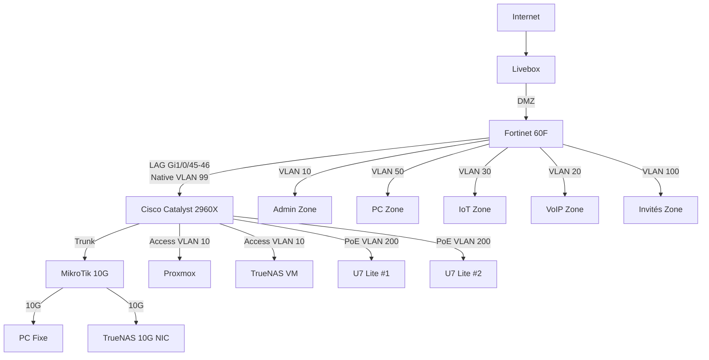

# 🔥 Homelab VLAN Refactor — Expert Playbook

> **Playbook technique complet, structuré et argumenté** pour refondre une infrastructure homelab vers une architecture réseau segmentée, moderne, observable et maintenable, inspirée de la reconstruction réseau documentée par **iMot3k**.

[](playbook/)
[](hardware/)
[](#)
[](#-licence)

---

## Table des matières

1. [Vision du projet](#-vision-du-projet)
2. [Pourquoi ce dépôt existe](#-pourquoi-ce-dépôt-existe)
3. [Objectifs techniques et opérationnels](#-objectifs-techniques-et-opérationnels)
4. [À qui s’adresse ce playbook](#-à-qui-sadresse-ce-playbook)
5. [Ce que couvre ce dépôt](#-ce-que-couvre-ce-dépôt)
6. [Ce que ce dépôt ne couvre pas](#-ce-que-ce-dépôt-ne-couvre-pas)
7. [Résumé exécutif](#-résumé-exécutif)
8. [Principes d’architecture](#-principes-darchitecture)
9. [Topologie cible](#-topologie-cible)
10. [Segmentation VLAN et plan IP](#-segmentation-vlan-et-plan-ip)
11. [Choix matériels et arbitrages budgétaires](#-choix-matériels-et-arbitrages-budgétaires)
12. [Méthodologie de migration](#-méthodologie-de-migration)
13. [Comment lire et exécuter ce dépôt](#%EF%B8%8F-comment-lire-et-exécuter-ce-dépôt)
14. [Structure détaillée du dépôt](#%EF%B8%8F-structure-détaillée-du-dépôt)
15. [Philosophie “débat d’experts”](#-philosophie-débat-dexperts)
16. [Gestion des risques et stratégie de rollback](#%EF%B8%8F-gestion-des-risques-et-stratégie-de-rollback)
17. [Validation post-migration](#-validation-post-migration)
18. [Roadmap et évolutions futures](#%EF%B8%8F-roadmap-et-évolutions-futures)
19. [Références](#-références)
20. [Contribuer](#-contribuer)
21. [Licence](#-licence)
22. [Avertissement final](#-avertissement-final)

---

## 🧭 Vision du projet

Ce dépôt n’est pas simplement une collection de fichiers de configuration, ni une suite de notes prises “au fil de l’eau”.  
Il s’agit d’un **playbook de transformation d’infrastructure** appliqué à un homelab avancé, avec une approche volontairement proche des standards professionnels :

- architecture cible explicitée,
- arbitrages techniques documentés,
- procédures séquencées,
- validations intermédiaires,
- stratégie de rollback,
- et perspective d’exploitation après migration.

L’idée est simple : beaucoup de homelabs atteignent un moment charnière où le réseau plat d’origine devient un frein.  
Ce qui était pratique au début devient progressivement source de fragilité :

- sécurité insuffisante,
- performances inégales,
- dépendances implicites,
- complexité croissante,
- difficulté à dépanner ou à faire évoluer l’existant.

Ce dépôt propose donc une réponse structurée à cette transition : **passer d’un bricolage fonctionnel à une infrastructure cohérente**, sans perdre l’esprit pratique, expérimental et budgétairement réaliste du homelab.

---

## ❓ Pourquoi ce dépôt existe

Dans beaucoup d’environnements domestiques ou “prosumer”, l’infrastructure réseau s’est construite par couches successives :

1. une box opérateur,
2. un switch,
3. quelques points d’accès,
4. un NAS,
5. un hyperviseur,
6. quelques objets connectés,
7. puis, presque sans s’en rendre compte, une dizaine de services critiques.

Le résultat est souvent un réseau historiquement “plat” où :

- les postes utilisateurs,
- les équipements d’administration,
- les périphériques IoT,
- les caméras,
- les téléphones IP,
- les points d’accès Wi-Fi,
- les invités,
- et parfois même les sauvegardes

cohabitent trop librement.

Ce dépôt existe pour casser cette dérive et proposer une trajectoire claire vers :

- une **segmentation par usage**,
- un **routage inter-VLAN maîtrisé**,
- un **Wi-Fi plus intelligent**,
- un **backbone plus robuste**,
- un **stockage mieux exploité**,
- et une **exploitation future plus sereine**.

Il s’inspire d’un cas réel, documenté publiquement, puis reformulé ici sous une forme **plus exhaustive, plus structurée et plus réutilisable**.

---

## 🎯 Objectifs techniques et opérationnels

Ce playbook vise simultanément plusieurs objectifs.

### Objectifs techniques

- Remplacer un réseau plat par une **segmentation multi-VLAN** claire et durable.
- Établir un **plan IP cohérent**, lisible et extensible.
- Mettre en place un **LAG LACP** entre le pare-feu et le switch cœur.
- Centraliser les services d’adressage et de résolution via **Windows Server 2022**.
- Déployer une stratégie Wi-Fi réduisant la prolifération de SSID via **PPSK**.
- Isoler proprement les flux sensibles : administration, clients, IoT, invités, VoIP, caméras.
- Ajouter une couche de robustesse pour la sauvegarde et le stockage via **10 Gb/s** et **Rsync**.

### Objectifs opérationnels

- Disposer d’une documentation exécutable et réutilisable.
- Réduire les décisions implicites pendant la migration.
- Permettre une exécution progressive avec points de contrôle.
- Rendre le rollback possible sans improvisation.
- Faciliter la maintenance future.
- Donner à la communauté un modèle réaliste, pas seulement théorique.

---

## 👥 À qui s’adresse ce playbook

Ce dépôt s’adresse principalement :

- aux passionnés de homelab qui ont dépassé le stade “switch non manageable + Wi-Fi unique” ;
- aux administrateurs systèmes/réseaux souhaitant formaliser leur lab comme un mini SI ;
- aux profils techniques qui veulent comprendre **pourquoi** une architecture est choisie, et pas seulement **quelle commande taper** ;
- aux personnes qui aiment les arbitrages techniques explicites — même quand ils sont discutables, tant qu’ils sont documentés.

Ce dépôt est particulièrement utile si vous travaillez avec ou autour de :

- Fortinet,
- Cisco Catalyst,
- UniFi,
- Proxmox,
- TrueNAS,
- Windows Server,
- équipements d’occasion reconditionnés,
- budgets contenus,
- environnements hybrides domestiques / labo / auto-hébergement.

---

## 📦 Ce que couvre ce dépôt

Le périmètre couvert est large et volontairement transversal.

### Réseau

- segmentation VLAN,
- trunking,
- LAG LACP,
- native VLAN de blackhole,
- routage inter-VLAN,
- DHCP relay,
- principes de filtrage,
- exposition raisonnée des services.

### Wi-Fi

- architecture UniFi,
- limitation du nombre de SSID,
- PPSK avec affectation logique par usage,
- VLAN de management des AP,
- cas d’usage roaming et services multicast.

### Compute et stockage

- intégration Proxmox / TrueNAS,
- évolution du chemin de stockage,
- arbitrages HBA / NVMe / PCIe,
- connectivité 10 Gb/s,
- stratégie de synchronisation et de backup.

### Exploitation

- runbooks,
- matrices de risques,
- validation post-migration,
- roadmap,
- documentation de décisions,
- logique de standardisation.

---

## 🚫 Ce que ce dépôt ne couvre pas

Ce dépôt est ambitieux, mais il n’est pas infini.

Il ne constitue pas :

- une certification de sécurité,
- un référentiel de conformité réglementaire,
- une architecture “enterprise” au sens strict,
- un guide universel valable sans adaptation,
- ni une garantie que chaque matériel tiers se comportera exactement de la même manière.

Il ne remplace pas non plus :

- la lecture de la documentation officielle des constructeurs,
- les sauvegardes de configuration avant changement,
- les tests en environnement isolé,
- ni le bon sens élémentaire face à une commande destructrice.

En résumé : ce dépôt est un **excellent plan de bataille**, pas un bouton magique.

---

## 🎯 Résumé exécutif

Ce dépôt documente la reconstruction **from scratch** d’une infrastructure homelab avancée avec les axes suivants :

- **Segmentation VLAN** par usage : administration, postes clients, IoT, VoIP, invités, management Wi-Fi, caméras, réseau transitoire ;
- **Plan d’adressage homogène** sur la base \(10.20.x.0/24\), avec conventions simples et répétables ;
- **Agrégation de liens LACP** entre un **Fortinet 60F** et un **Cisco Catalyst 2960X** ;
- **Wi-Fi on-premises avec PPSK** via **Ubiquiti U7 Lite** et contrôleur local ;
- **Backbone local à 10 Gb/s** pour améliorer les flux stockage et sauvegardes ;
- **Chaîne de sauvegarde outillée** autour de **TrueNAS**, **QNAP** et **Rsync** ;
- **Budget occasion maîtrisé**, avec une cible réaliste autour de \~1000 €.

Le résultat recherché n’est pas seulement un réseau “qui fonctionne”, mais un réseau :

- compréhensible,
- segmenté,
- mesurable,
- évolutif,
- et documenté comme un vrai système.

---

## 🏗️ Principes d’architecture

Plusieurs principes structurent l’ensemble du dépôt.

### 1. Segmenter par intention, pas par gadget

Chaque VLAN répond à un besoin d’exploitation clair.  
On évite les VLANs “parce qu’on peut”, et on préfère les VLANs “parce qu’ils servent”.

### 2. Éviter la dépendance au réseau plat historique

Le VLAN transitoire “Merdouille” existe pour faciliter la migration, pas pour durer.  
Il doit se vider progressivement jusqu’à disparition.

### 3. Réduire le couplage implicite

Quand un service doit être accessible entre VLANs, cela doit être voulu, documenté et filtré.

### 4. Préserver l’exploitabilité

Un réseau très sophistiqué mais impossible à maintenir n’est pas un progrès.  
La lisibilité et la reproductibilité restent prioritaires.

### 5. Utiliser l’occasion intelligemment

Le dépôt assume un positionnement “haut niveau technique, budget contenu”.  
Le marché de l’occasion permet d’obtenir du matériel très solide à faible coût — à condition d’en comprendre les limites.

### 6. Prévoir l’après-migration

L’architecture cible n’est pas un instantané.  
Elle prépare les futures couches : observabilité, IaC, monitoring, alerting, sauvegarde hors site.

---

## 🗺️ Topologie cible



Voir aussi : [docs/01-architecture/network-topology.mmd](docs/01-architecture/network-topology.mmd)

Cette topologie repose sur une logique claire :

- le **Fortinet** porte le rôle de sécurité, routage et relais ;
- le **Cisco** tient le rôle de cœur L2 robuste ;
- le **MikroTik** apporte le segment 10 Gb/s utile aux workloads gourmands ;
- les **AP UniFi** assurent une couche d’accès moderne avec flexibilité radio ;
- la pile **Proxmox / TrueNAS / Windows Server** concentre les services internes.

---

## 🌐 Segmentation VLAN et plan IP

Le plan d’adressage repose sur une convention simple et facile à mémoriser :
chaque usage principal dispose d’un /24 dans la plage \(10.20.x.0/24\), avec une passerelle en `.254`.

| ID | Nom | Réseau | Passerelle | SSID/PPSK | Équipements | Sécurité |
|----|-----|--------|------------|-----------|-------------|----------|
| 10 | Admin | 10.20.10.0/24 | 10.20.10.254 | - | Switches, hyperviseurs, NAS, équipements de gestion | Filtrage strict |
| 20 | VoIP | 10.20.20.0/24 | 10.20.20.254 | - | Téléphones IP, softphones, équipements voix | Priorisation/QoS |
| 30 | IoT | 10.20.30.0/24 | 10.20.30.254 | SSID Home / PPSK dédié | Domotique, services connectés, équipements contraints | Isolation renforcée |
| 50 | PC | 10.20.50.0/24 | 10.20.50.254 | SSID Home / PPSK dédié | Postes fixes, laptops, imprimantes | Accès Internet et ressources internes |
| 100 | Invités | 10.20.100.0/24 | 10.20.100.254 | SSID Invités | Appareils visiteurs | Isolation totale |
| 200 | WiFi Mgmt | 10.20.200.0/24 | 10.20.200.254 | - | APs UniFi, contrôleur, management radio | Administration seulement |
| 300 | Caméras | 10.20.300.0/24 | 10.20.300.254 | - | Caméras IP, NVR/UNVR | Isolé et contrôlé |
| 999 | Native / Blackhole | - | - | - | Trunks uniquement | Non routé |
| 1000 | Merdouille | 10.20.0.0/24 | 10.20.0.1 | - | Réseau transitoire de migration | À éliminer |

Détails : [docs/01-architecture/vlan-table.md](docs/01-architecture/vlan-table.md)

L’intérêt de ce plan est multiple :

- mémorisation facile ;
- diagnostic accéléré ;
- réduction des erreurs humaines ;
- documentation plus lisible ;
- évolution future plus simple.

---

## 💸 Choix matériels et arbitrages budgétaires

L’un des intérêts de ce projet est de démontrer qu’un homelab très crédible peut être construit sans budget absurde.

| Équipement | Modèle Référence | Prix Occasion | Source |
|------------|------------------|---------------|--------|
| Firewall | Fortinet 60F | 150-200€ | Leboncoin |
| Switch L2/L3 d’accès/cœur | Cisco Catalyst 2960X-48LPD-L | 50-80€ | eBay |
| Switch 10G | MikroTik CRS305 | 120-150€ | Leboncoin |
| HBA | LSI SAS 9300-8i | 80-120€ | eBay |
| AP Wi-Fi | Ubiquiti U7 Lite (x4) | ~400€ | Store / seconde main |
| NAS Backup | QNAP TS-453D | 200-250€ | Leboncoin |

**Total cible** : environ 1000 €

Voir aussi : [hardware/price-breakdown-1000eur.md](hardware/price-breakdown-1000eur.md)

Ce dépôt ne vend pas un “setup parfait”.  
Il documente des **compromis réalistes** :

- excellent rapport valeur/prix,
- matériel éprouvé,
- forte disponibilité en occasion,
- communauté abondante,
- marge d’évolution technique importante.

---

## 🧪 Méthodologie de migration

La migration n’est pas pensée comme un “grand soir” incontrôlé, mais comme une suite d’étapes raisonnées.

### Phases typiques

1. **Préparation**
   - inventaire,
   - sauvegardes,
   - validation des accès,
   - préparation du rollback.

2. **Hardware**
   - HBA,
   - stockage,
   - liens montants,
   - interfaces.

3. **Réseau**
   - LAG,
   - trunks,
   - VLANs,
   - DHCP relay,
   - routage contrôlé.

4. **Wi-Fi**
   - contrôleur,
   - adoption AP,
   - VLAN management,
   - PPSK,
   - SSID.

5. **Compute et services**
   - Proxmox,
   - Windows Server,
   - services d’infrastructure.

6. **Backup**
   - flux de réplication,
   - rsync,
   - vérification des débits,
   - extinction planifiée du backup target.

7. **Automatisation et exploitation**
   - scripts,
   - monitoring,
   - alerting,
   - documentation finale.

Cette approche réduit le chaos et permet de conserver une lecture claire de l’état du système.

---

## ▶️ Comment lire et exécuter ce dépôt

Le dépôt peut être lu de deux manières :

### Lecture rapide — “compréhension d’ensemble”

Si vous voulez d’abord comprendre l’architecture et les choix :

1. lisez ce `README.md` ;
2. parcourez `docs/01-architecture/` ;
3. lisez les synthèses de décision ;
4. consultez la matrice de risques ;
5. examinez la roadmap.

### Lecture opérationnelle — “je vais exécuter la migration”

Si vous voulez réellement reproduire ou adapter la migration :

1. commencez par la préparation ;
2. suivez les phases dans l’ordre ;
3. lisez les débats d’experts avant chaque décision importante ;
4. appliquez les procédures ;
5. exécutez les validations ;
6. gardez les rollbacks à portée de main ;
7. documentez vos écarts si votre matériel diffère.

Exemple de navigation :

```bash
# Phase 1 : Préparation
cd playbook/01-preparation/
cat procedures.md

# Phase 2 : Hardware
cd ../02-phase-hardware/
# Lire debate-experts.md puis decision-synthesis.md
# Exécuter procedures.md
# Valider via validation-tests.md

# Phase 3 : Réseau
cd ../03-phase-network/
# Répéter la même logique : débat → décision → procédure → validation

# Phases suivantes
# Wi-Fi, compute, backup, automation
```

---

## 🗂️ Structure détaillée du dépôt

La structure du dépôt est pensée pour séparer les types de savoir :

- **référence**,
- **décision**,
- **procédure**,
- **validation**,
- **risque**,
- **évolution**.

Exemple de logique de contenu :

- `docs/` : architecture, références, schémas, tables VLAN, contexte source ;
- `hardware/` : arbitrages matériels, coûts, alternatives ;
- `playbook/` : séquencement par phases d’exécution ;
- `risk-management/` : risques identifiés et rollbacks ;
- `validation/` : checklists et tests ;
- `roadmap/` : évolutions futures.

Cette structuration rend le dépôt utile à la fois comme :

- mémoire technique,
- guide exécutable,
- support pédagogique,
- et base de travail collaborative.

---

## 🧠 Philosophie “débat d’experts”

L’une des originalités de ce dépôt est de ne pas cacher les arbitrages derrière une réponse unique.

Chaque décision importante peut être présentée sous forme de discussion entre rôles techniques :

- `[CiscoFan]`
- `[FortiGuru]`
- `[StorageNinja]`
- `[WiFiMaster]`
- `[BudgetHack]`

L’objectif n’est pas de “jouer à plusieurs personnages” pour faire joli.  
L’objectif est de **matérialiser les tensions réelles** entre :

- robustesse,
- simplicité,
- coût,
- maintenabilité,
- performance,
- standardisation.

Autrement dit, le dépôt montre non seulement **ce qui a été choisi**, mais aussi **pourquoi les autres options n’ont pas été retenues**.

Exemple : [LAG Native VLAN 99 vs VLAN 1](playbook/03-phase-network/debate-experts.md)

---

## ⚠️ Gestion des risques et stratégie de rollback

Toute refonte réseau sérieuse suppose une vraie discipline de gestion des risques.

Voici un aperçu des scénarios principaux :

| Risque | Impact | Probabilité | Détection | Rollback |
|--------|--------|-------------|-----------|----------|
| Perte accès Fortinet | Critique | Moyenne | Ping/GUI/SSH inaccessibles | [rollback-fortinet.md](risk-management/rollback-fortinet.md) |
| Trunk mal tagué | Majeur | Moyenne | VLANs injoignables | [rollback-trunk-misconfiguration.md](risk-management/rollback-trunk-misconfiguration.md) |
| Boucle ou agrégat incohérent | Majeur | Faible à moyenne | Instabilité L2, MAC flapping, pertes | Voir runbooks réseau |
| Corruption durant manipulation stockage | Majeur | Faible | erreurs I/O, checksum, logs | [rollback-nvme-corruption.md](risk-management/rollback-nvme-corruption.md) |
| Échec de synchronisation backup | Mineur à majeur selon contexte | Moyenne | logs rsync / absence de snapshot | [rollback-rsync-failure.md](risk-management/rollback-rsync-failure.md) |
| Dysfonctionnement PPSK | Mineur | Faible | clients Wi-Fi déconnectés | [rollback-ppsk-down.md](risk-management/rollback-ppsk-down.md) |

Ce dépôt recommande systématiquement :

- une sauvegarde de configuration avant changement ;
- un accès d’administration de secours ;
- une fenêtre d’intervention explicite ;
- une validation après chaque étape ;
- et un plan de retour arrière simple à exécuter.

---

## ✅ Validation post-migration

Une migration n’est terminée que lorsqu’elle est validée.  
“Ça ping” n’est pas une stratégie de recette — c’est juste un début.

Checklist simplifiée :

- [ ] Débit 10 Gb/s mesuré de manière crédible, par exemple via `iperf3`
- [ ] Scopes DHCP opérationnels et correctement distribués
- [ ] Résolution DNS fonctionnelle depuis chaque segment autorisé
- [ ] Roaming Wi-Fi validé entre APs
- [ ] PPSK appliquant bien la segmentation attendue
- [ ] mDNS/Bonjour fonctionnel uniquement là où il doit l’être
- [ ] Flux de sauvegarde exécutés avec journaux exploitables
- [ ] Alertes et supervision activées
- [ ] Documentation mise à jour après exécution réelle

Checklist complète : [validation/checklist-post-migration.md](validation/checklist-post-migration.md)

---

## 🛣️ Roadmap et évolutions futures

Ce dépôt documente une cible viable, mais il prépare aussi la suite.

### Court terme

- observabilité réseau et système ;
- tableaux de bord Grafana ;
- collecte Prometheus ;
- supervision des services clés ;
- sauvegarde chiffrée hors site.

### Moyen terme

- Infrastructure as Code ;
- modèles Ansible/Terraform ;
- tests automatisés de conformité ;
- pipelines de vérification de configuration ;
- gestion plus fine des secrets.

### Long terme

- architecture plus déclarative ;
- durcissement systématique ;
- segmentation plus granulaire ;
- contrôle d’accès contextuel ;
- documentation versionnée des décisions d’architecture.

Détails : [roadmap/0-30-days.md](roadmap/0-30-days.md)

---

## 📚 Références

- **Vidéo source** : [iMot3k - Je change TOUT mon réseau](https://www.youtube.com/watch?v=6qiOrChWWvs)
- **Transcription** : [docs/00-reference-imot3k/transcription-video.md](docs/00-reference-imot3k/transcription-video.md)
- **Inventaire matériel** : [docs/00-reference-imot3k/inventaire-materiel.md](docs/00-reference-imot3k/inventaire-materiel.md)

Ce dépôt transforme une inspiration vidéo en corpus technique organisé, exécutable et réutilisable.

---

## 🤝 Contribuer

Les contributions sont bienvenues, en particulier sur :

- variantes matérielles réellement testées ;
- corrections de configuration ;
- améliorations de validation ;
- retours d’expérience de migration ;
- simplifications documentaires ;
- alternatives budgétaires crédibles.

Si vous proposez une contribution, essayez d’indiquer :

- votre matériel,
- votre contexte,
- les écarts par rapport au scénario principal,
- les résultats observés,
- les limites rencontrées.

Une bonne contribution n’est pas seulement “ça marche chez moi” ; c’est “voici pourquoi, dans quel contexte, avec quelles preuves”.

---

## 📄 Licence

MIT License.

Vous pouvez utiliser, adapter et redistribuer ce dépôt, sous réserve de conserver les mentions appropriées et de comprendre que les configurations fournies restent des **gabarits à adapter** à votre propre environnement.

---

## 🧾 Avertissement final

Ce playbook a été conçu pour être utile, robuste et pragmatique.  
Il reste néanmoins de votre responsabilité de :

- sauvegarder vos configurations,
- tester avant production,
- adapter les paramètres à votre matériel réel,
- vérifier la compatibilité logicielle,
- et ne pas brancher un trunk critique en improvisant un vendredi soir après 23h.

Le réseau a un sens de l’humour discutable.

---

**Mainteneur** : [@valorisa](https://github.com/valorisa)  
**Profil GitHub** : [https://github.com/valorisa](https://github.com/valorisa)
